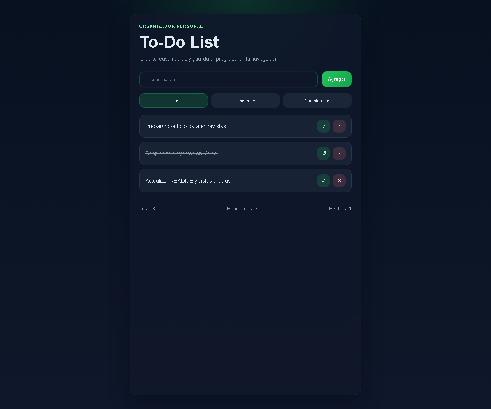

#  To-Do List

Aplicación de lista de tareas desarrollada con HTML, CSS y JavaScript vanilla, utilizando localStorage para persistencia de datos.

---

##  Demo en vivo

👉 [Ver online](https://listadetareaspendientes.netlify.app)

---

## 📸 Vista previa

---

## Funcionalidades

- Agregar tareas
- Marcar tareas como completadas
- Eliminar tareas
- Filtrar tareas (todas / pendientes / completadas)
- Persistencia de datos con localStorage

---

## Tecnologías utilizadas

- HTML5
- CSS3
- JavaScript (Vanilla)

---

## Aprendizajes

Este proyecto me permitió practicar:

- Manipulación del DOM
- Eventos en JavaScript
- Uso de arrays y objetos
- Persistencia con localStorage
- Lógica de filtrado
